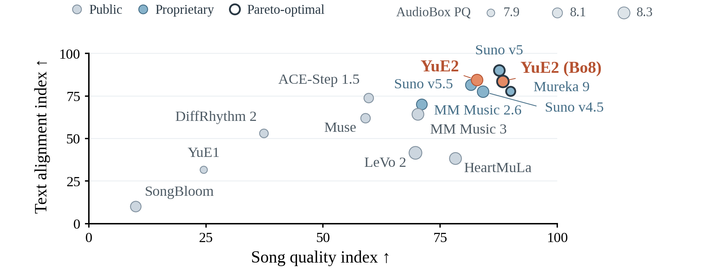
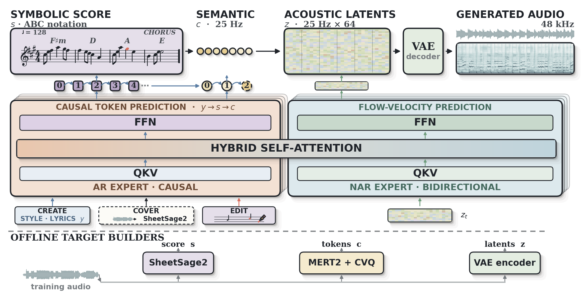

> Looking for the original YuE? Its code, documentation, and license are preserved on the **[YuE-v1 branch](https://github.com/multimodal-art-projection/YuE/tree/YuE-v1)**.

<p align="center">
  
</p>

<h1 align="center">YuE2 — Frontier Music Generation with Symbolic Planning</h1>

<p align="center"><strong>Compose in symbols. Create in sound.</strong></p>

<p align="center">
  <a href="https://map-yue2.github.io/">🎧 Demos</a> ·
  <a href="https://huggingface.co/m-a-p/YuE2-3B">🤗 Model</a> ·
  <a href="#quick-start">🚀 Quick start</a> ·
  <a href="#agent-skill">🤖 Agent skill</a> ·
  <a href="#benchmarks">📊 Benchmarks</a> ·
  <a href="https://github.com/multimodal-art-projection/YuE/releases/tag/yue2-v0.1.6">📦 Release</a> ·
  <a href="https://discord.gg/ssAyWMnMzu">Discord</a>
</p>

**YuE2 brings frontier song quality to music generation with an editable composition.** Give it lyrics and a style prompt: it writes a melody-and-chord plan, then realizes that plan as a complete song with vocals and accompaniment.

- **Frontier quality.** Competitive with the evaluated proprietary systems on WildSongBench. YuE2 (best-of-8) achieves **6.9632 SongBench Avg**, the highest observed mean among all evaluated settings.
- **White-box music generation through symbolic planning.** Read, play, and change the composition before rendering it. Melody and chords become explicit controls that a person or an agent can inspect and edit.
- **Zero-shot covers and agentic editing.** Reimagine a transcribed song in a new style, or refine a song through a conversation about its score, arrangement, and lyrics—all with the same generation checkpoint.

[](https://map-yue2.github.io/#model-overview)

*192 WildSongBench prompts. Both YuE2 settings use symbolic planning. Bo8 = best-of-8. The axes are normalized comparison indices; bubble area represents AudioBox production quality. [Scores and evaluation protocol](docs/benchmarks.md).*

## Hear what you can make

| Create | Cover | Edit with an agent |
|---|---|---|
| Lyrics + style → score → full song | Source recording → melody score → a new interpretation | Musical feedback → score, style, or lyric revisions → a new recording |
| [Listen and inspect the score](https://map-yue2.github.io/#abc-cot-gen) | [Hear zero-shot covers](https://map-yue2.github.io/#cover) | [Follow an editing conversation](https://map-yue2.github.io/#agentic-music-editing) |

The agentic demo follows **The Last Train through 9 steps and 14 versions**, from Mandarin pop to English jazz with new harmony and a saxophone solo. Listen to each version and inspect its conversation, score, prompt, and lyrics.

## How it works



One **AR–NAR Mixture-of-Transformers** backbone predicts the score and semantic tokens autoregressively, then generates acoustic latents with flow matching. A VAE decodes those latents into stereo audio. Creation, covering, and editing differ in where the score comes from: YuE2, a transcribed recording, or an edited composition.

The staged Python API exposes `plan()` → `generate_semantic()` → `synthesize()` → `decode()`. See the [generation guide](docs/generation.md) for exact-plan reuse and decoder selection.

## Quick start

**Linux · Python 3.12 · NVIDIA GPU with BF16 support and 24 GB VRAM.** YuE2 produces 48 kHz stereo audio without quantization. Model files download from Hugging Face on first use.

```bash
git clone https://github.com/multimodal-art-projection/YuE.git
cd YuE
python3.12 -m venv .venv
source .venv/bin/activate
python -m pip install --upgrade pip
python -m pip install .
python examples/generate.py --output outputs/first-song
```

Open `outputs/first-song/audio.flac`. The output directory also retains the score, semantic tokens, acoustic latents, generation settings, and model identities.

The Python interface is equally short:

```python
import json
from pathlib import Path
from yue2 import YuE2Pipeline

request = json.loads(Path("examples/song.json").read_text(encoding="utf-8"))
with YuE2Pipeline.from_pretrained("m-a-p/YuE2-3B", device="cuda") as pipe:
    song = pipe(**request)
    song.save_artifacts("outputs/my-song")
    print(song.truncated)
```

| Setting | Behavior |
|---|---|
| `cot="full"` | Generate an editable melody-and-chord plan; the default for new songs |
| `cot="melody"` | Use a melody plan with free accompaniment; recommended for covers |
| `cot="off"` | Generate directly from lyrics and style |
| `abc=...` | Supply your own score in `full` or `melody` mode |

[Generation guide](docs/generation.md) · [Original example inputs](examples/README.md) · [Download the wheel](https://github.com/multimodal-art-projection/YuE/releases/download/yue2-v0.1.6/yue2_infer-0.1.6-py3-none-any.whl)

## Cover a song

Transcribe a source recording with **[SheetSage2](https://huggingface.co/m-a-p/SheetSage2)**, review its melody ABC, and provide new lyrics or a target style. For covers, use **`cot="melody"` and a score without chord symbols** so the accompaniment can adapt to the new style.

```python
from pathlib import Path
from yue2 import YuE2Pipeline

with YuE2Pipeline.from_pretrained("m-a-p/YuE2-3B", device="cuda") as pipe:
    cover = pipe(
        style="English, jazz-funk, warm lead vocal, Rhodes, bass and drums",
        lyrics=Path("cover-lyrics.txt").read_text(encoding="utf-8"),
        abc=Path("cover-score/score.abc").read_text(encoding="utf-8"),
        cot="melody",
        seed=42,
    )
    cover.save_artifacts("outputs/cover")
```

SheetSage2 runs in a separate environment and loads its MERT2 encoder automatically. The [cover guide](docs/covers.md) gives the complete transcription and generation commands. An included [original melody example](examples/melody.abc) also lets you try score-conditioned generation immediately.

## Edit a composition

Export a plan, revise the musical details, and render the edited score:

```python
import json
from pathlib import Path
from yue2 import YuE2Pipeline

request = json.loads(Path("examples/song.json").read_text(encoding="utf-8"))
with YuE2Pipeline.from_pretrained("m-a-p/YuE2-3B", device="cuda") as pipe:
    plan = pipe.plan(**request)
    plan.save("outputs/plan")
```

Copy `outputs/plan/score.abc` to `edited.abc`, then ask an agent to change its harmony, melody, tempo, or form. Supply the edited file as a new score:

```bash
python examples/generate.py --request examples/song.json \
  --abc-file edited.abc --cot full --output outputs/edited
```

The editable score is the white-box interface: you can inspect the intended composition and intervene on it. Editing generates a new complete recording; it does not preserve the original waveform outside an edit. [Editing guide and a reproducible harmony example](docs/editing.md).

## Agent skill

The **[yue2-music skill](skills/yue2-music/SKILL.md)** teaches an agent how to generate songs, transcribe and cover recordings, edit ABC scores, check musical invariants, and organize listening comparisons. It includes portable helpers and references to the released model interfaces.

**[Download the skill ZIP](https://github.com/multimodal-art-projection/YuE/releases/download/yue2-v0.1.6/yue2-music.zip)**, or use `skills/yue2-music/` directly with an agent that supports `SKILL.md` packages. Install it using your agent's skill-directory or import mechanism; the Python runtime is installed separately with `pip install .`.

Try a concrete request:

> Use the yue2-music skill to create an English piano-pop song. Keep the original audio and score. Make a second version with jazz harmony, preserve the vocal melody and lyric order, and give me both versions to compare.

## Benchmarks

**WildSongBench: 192 prompts, automatic evaluation, September 5, 2026.**

| System / setting | SongBench Avg ↑ | AudioBox PQ ↑ | MuLan ↑ | PER ↓ |
|---|---:|---:|---:|---:|
| YuE 1 | 4.9165 | 7.8683 | 0.2623 | 36.38% |
| Suno v5 | 6.8721 | 8.1698 | **0.5428** | **8.10%** |
| Mureka 9 | 6.9377 | 8.0226 | 0.4394 | 11.69% |
| **YuE2** | 6.7316 | 8.2598 | 0.5068 | 8.44% |
| **YuE2 (best-of-8)** | **6.9632** | **8.2714** | 0.5051 | 9.79% |

Both YuE2 settings use symbolic planning and the benchmark decoder, **YuE2-Vae-legacy**. Standard YuE2 selects from two candidates; best-of-8 selects from eight. The full comparison contains 15 settings. Rankings vary by metric; the small gap between the highest means does not establish statistical significance. [Full results and selection protocols](docs/benchmarks.md).

**Zero-shot covers.** On 948 works, full-score YuE2 reaches **0.647 CLEWS mAP**, compared with **0.006 without a score**, while using the general generator without cover-specific fine-tuning. Source-identity preservation and target-style quality are measured separately; melody-only covers offer more freedom to change the arrangement. [Cover evaluation](docs/benchmarks.md#zero-shot-cover-generation).

## Models and resources

| Resource | Purpose |
|---|---|
| [YuE2-3B](https://huggingface.co/m-a-p/YuE2-3B) | Song generation, symbolic planning, covering, and editing |
| [YuE2-Vae](https://huggingface.co/m-a-p/YuE2-Vae) | Default generation and listening decoder |
| [YuE2-Vae-legacy](https://huggingface.co/m-a-p/YuE2-Vae-legacy) | Decoder for the reported benchmark protocol |
| [SheetSage2](https://huggingface.co/m-a-p/SheetSage2) | Audio-to-score transcription for covers and editing |
| [MERT-v2-FullSong](https://huggingface.co/m-a-p/MERT-v2-FullSong) | Full-song music representations; SheetSage2's encoder |
| [MERT-v2-30s](https://huggingface.co/m-a-p/MERT-v2-30s) | Music representations for short recordings |
| [WildSongBench](https://huggingface.co/datasets/m-a-p/WildSongBench) | Evaluation prompts and benchmark resources |

MERT2 feature extraction is optional for generation. YuE2's pipeline does not require a separate MERT2 model download. [Demos and interactive results](https://map-yue2.github.io/) · [Release downloads](https://github.com/multimodal-art-projection/YuE/releases/tag/yue2-v0.1.6).

## License

YuE2's first-party code, agent skill, and model weights are released under **[CC BY-NC 4.0](LICENSE)**. Third-party components retain their [original licenses](THIRD_PARTY_NOTICES.md). The archived [YuE-v1 branch](https://github.com/multimodal-art-projection/YuE/tree/YuE-v1) retains its original license.

## Citation

The YuE2 technical report is coming soon. For now, please cite **[MERT](https://arxiv.org/abs/2306.00107)** and **[YuE](https://arxiv.org/abs/2503.08638)**:

```bibtex
@article{li2023mert,
  title = {{MERT}: Acoustic Music Understanding Model with Large-Scale Self-supervised Training},
  author = {Li, Yizhi and Yuan, Ruibin and Zhang, Ge and Ma, Yinghao and Chen, Xingran and Yin, Hanzhi and Xiao, Chenghao and Lin, Chenghua and Ragni, Anton and Benetos, Emmanouil and Gyenge, Norbert and Dannenberg, Roger and Liu, Ruibo and Chen, Wenhu and Xia, Gus and Shi, Yemin and Huang, Wenhao and Wang, Zili and Guo, Yike and Fu, Jie},
  journal = {arXiv preprint arXiv:2306.00107},
  year = {2023},
  eprint = {2306.00107},
  archivePrefix = {arXiv},
  url = {https://arxiv.org/abs/2306.00107}
}

@article{yuan2025yue,
  title = {{YuE}: Scaling Open Foundation Models for Long-Form Music Generation},
  author = {Yuan, Ruibin and Lin, Hanfeng and Guo, Shuyue and Zhang, Ge and Pan, Jiahao and Zang, Yongyi and Liu, Haohe and Liang, Yiming and Ma, Wenye and Du, Xingjian and Du, Xinrun and Ye, Zhen and Zheng, Tianyu and Jiang, Zhengxuan and Ma, Yinghao and Liu, Minghao and Tian, Zeyue and Zhou, Ziya and Xue, Liumeng and Qu, Xingwei and Li, Yizhi and Wu, Shangda and Shen, Tianhao and Ma, Ziyang and Zhan, Jun and Wang, Chunhui and Wang, Yatian and Chi, Xiaowei and Zhang, Xinyue and Yang, Zhenzhu and Wang, Xiangzhou and Liu, Shansong and Mei, Lingrui and Li, Peng and Wang, Junjie and Yu, Jianwei and Pang, Guojian and Li, Xu and Wang, Zihao and Zhou, Xiaohuan and Yu, Lijun and Benetos, Emmanouil and Chen, Yong and Lin, Chenghua and Chen, Xie and Xia, Gus and Zhang, Zhaoxiang and Zhang, Chao and Chen, Wenhu and Zhou, Xinyu and Qiu, Xipeng and Dannenberg, Roger and Liu, Jiaheng and Yang, Jian and Huang, Wenhao and Xue, Wei and Tan, Xu and Guo, Yike},
  journal = {arXiv preprint arXiv:2503.08638},
  year = {2025},
  eprint = {2503.08638},
  archivePrefix = {arXiv},
  url = {https://arxiv.org/abs/2503.08638}
}
```
